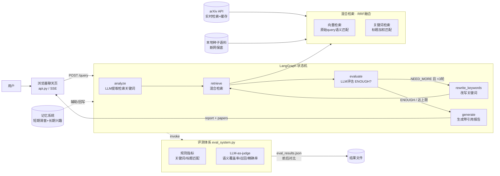

# 智能论文检索系统（Agentic RAG）

基于 LangGraph 的**多轮智能论文检索问答系统**：接入 arXiv 实时检索，用 Agent 循环自主决定"检索是否足够"，支持用户兴趣记忆，并内置完整的评测体系（规则指标 + LLM-as-judge）。

## 项目简介

传统 RAG 是"一次检索 + 直接生成"，检索质量无法自我纠错。本项目把检索流程构建为 LangGraph 状态机，由 LLM 评估检索结果、自主决定继续检索还是生成答案：

- **混合检索**：向量语义检索 + 关键词精确检索，RRF 倒数排名融合
- **多轮自主决策**：检索 → LLM 评估（ENOUGH / NEED_MORE）→ 不足则改写关键词再检索（最多 3 轮）
- **真实 arXiv 接入**：urllib 直连 arXiv API（含 SSL 降级容错、本地缓存、限流）
- **记忆系统**：短期记忆（滑窗对话）+ 长期记忆（用户兴趣画像持久化）
- **双重评测**：规则指标（关键词/标题匹配）+ LLM-as-judge 语义裁判，自动导出结果并前后对比

## 快速开始

### 环境准备

```bash
# Python 3.12，创建虚拟环境并安装依赖
pip install -r requirements.txt

# 设置阿里云百炼 API Key（LLM + Embedding 都用它）
# Windows PowerShell:
$env:DASHSCOPE_API_KEY = "你的key"
# Linux/Mac:
export DASHSCOPE_API_KEY="你的key"
```

### 三种运行方式

```bash
# 1. 启动 Web 服务（浏览器打开 http://localhost:8000，SSE 实时展示Agent过程）
python api.py

# 2. 运行全量评测（20条用例，规则指标 + LLM裁判，导出 eval_results.json）
python agentic_rag_hybrid.py

# 3. 运行单元测试（28个离线用例，无需API key）
python -m pytest tests -v
```

### Docker（可选）

```bash
docker build -t paper-agent .
docker run -p 8000:8000 -e DASHSCOPE_API_KEY=你的key paper-agent
```

## 系统架构



## 评测结果（20条用例：single-hop / comparison / multi-hop）

最终版全量评测（规则口径）：

| 指标 | 数值 |
|---|---|
| 平均检索准确率 | **81.0%** |
| 平均回答准确率 | **96.2%** |
| 平均检索轮数 | 1.3 |
| 平均响应时间 | 10.7s |

LLM-as-judge 语义口径（同一运行，n=20）：

| 指标 | 数值 | 说明 |
|---|---|---|
| 回答要点覆盖率 | 83.6% | 期望要点被语义覆盖的比例 |
| 检索召回率 | 81.0% | 期望论文被覆盖的比例（语义匹配） |
| 检索精确率 | **31.1%** | 召回论文中真正相关的比例——暴露了Top-N扩召回的代价，下一步加重排序 |

## 消融实验（优化过程，均为规则口径）

| 版本 | 检索准确率 | 回答准确率 | 平均轮数 | 响应时间 |
|---|---|---|---|---|
| 硬编码本地语料（接arXiv前） | 94.8% | 100% | 1.5 | 9.5s |
| 接入真实 arXiv | 52.5% | 95.6% | 2.0 | 28.1s |
| + 向量检索改原始query / 评测隔离记忆漂移 / 多轮query改写 | 60.0% | 96.2% | 1.7 | 19.4s |
| + 每轮Top-4→Top-6 / embedding换v4+磁盘缓存 | **81.0%** | 96.2% | 1.3 | 11.9s |

关键结论：
1. **记忆漂移**：长期记忆注入会污染关键词提取（评测中关键词跑偏成 `model interpretability` 等），评测模式需隔离记忆的注入与写入
2. **评测驱动优化**：规则指标只看出"期望论文命中"，LLM裁判才暴露出精确率仅 31% 的召回/精确率权衡——度量要先于优化
3. **Embedding缓存**：同一文本只调一次API，响应时间从 19.4s 降到 11.9s，同时节省云端免费额度

## 项目结构

```
paper-research-agent/
├── README.md                  # 本文件
├── requirements.txt           # 依赖清单
├── Dockerfile                 # All-in-One镜像（可选）
├── api.py                     # FastAPI服务 + 内置聊天页（SSE流式）
├── agentic_rag_hybrid.py      # 主程序：LangGraph Agent（混合检索+记忆+评测入口）
├── arxiv_retriever.py         # arXiv实时检索（缓存/限流/SSL容错）
├── memory_system.py           # 短期+长期记忆
├── eval_system.py             # 评测器（规则指标+LLM裁判+前后对比）
├── eval_dataset.json          # 20条人工标注评测集
├── baseline_rag.py            # 基线版本（单次RAG）
├── agentic_rag.py             # v1：Agent循环（纯关键词检索）
├── agentic_rag_hy_eval.py     # v2：混合检索+内联评测
└── tests/                     # pytest单元测试（28个离线用例）
    ├── test_memory_system.py
    ├── test_eval_system.py
    ├── test_arxiv_retriever.py
    └── test_embedding_cache.py
```

## 技术栈

Python 3.12 · LangChain / LangGraph · 阿里云百炼 qwen-plus + text-embedding-v4 · FastAPI + SSE · arXiv API · pytest
